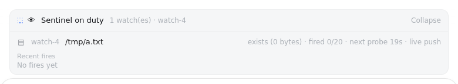

# dsh-sentinel

Condition-driven wakeup for DeepSeek Harness: the agent registers a watch, goes to sleep — even closes the session — and the sentinel wakes it when the condition happens. Every subscription and every fire is a user-visible session event, and the browser dock shows what is on duty.



## How it works

The node half owns one server-lifetime runtime that folds a plugin-owned sidecar log (`$DSH_HOME/sentinel.jsonl`) into live subscriptions, probes every sensor on a shared 5s heartbeat, and delivers wakeups through the official followup channel — resuming a dormant session's agent first when needed. Subscriptions therefore survive process restarts, and conditions that become true while the server is down late-fire on the next probe.

The browser half is a dock card above the composer (the `conversation.input.dock` family) listing the session's active watches — sensor, target, live probe state, fire budget, next-probe countdown — plus recent fire history when expanded. It polls the read-only state route and renders nothing when the session has no watches.

## Sensors

| Kind | Engine | Fires on |
| --- | --- | --- |
| `file` | path snapshot + inotify push | snapshot change (sub-second); accelerated by fs events |
| `command` | read-only shell line, probed on an interval | output/exit-code change |
| `http` | URL probed on an interval | status/body change |
| `process` | `pgrep -f` pattern, probed on an interval | match-set change |
| `webhook` | pure push | any POST to the returned hook URL |

With `pattern`, probe kinds fire on the no-match→match edge of that regex and webhooks accept only matching payloads; without it, probe kinds fire on any change after the baseline.

## Tools

- `sentinel_watch` — register a watch: `kind`, `target`, optional `pattern`, `interval` (1–3600s, default 30), `note` (delivered verbatim with every wakeup), `maxFires` (default 1: one-shot), `cooldown` (default 60s), optional `ttl`.
- `sentinel_list` — active watches with live probe state.
- `sentinel_cancel` — cancel one watch by id.

## Routes

- `GET /plugins/dsh-sentinel/state?sessionId=…` — read-only state for the dock.
- `POST /plugins/dsh-sentinel/hook?id=watch-N` — webhook entry; put a `curl` into a CI job, git hook, or another machine's script to wake the agent.

## Install

Add the node half through a patch-list configuration over the shipped base:

```yaml
# cordis.patch.yml
- insert:
    - id: dsh-sentinel
      name: '@dsh-external/dsh-sentinel'
```

The browser half ships in the same package (`./client`) and is injected by the Web UI's plugin loader.

## Develop

```sh
npm install
npm run build     # tsc -b + tsdown (lib/index.js, lib/client.js)
npm test          # vitest: domain fold/normalize, sensors, e2e wakeup flow
```

## License

BSD 3-Clause. See [LICENSE](LICENSE).
