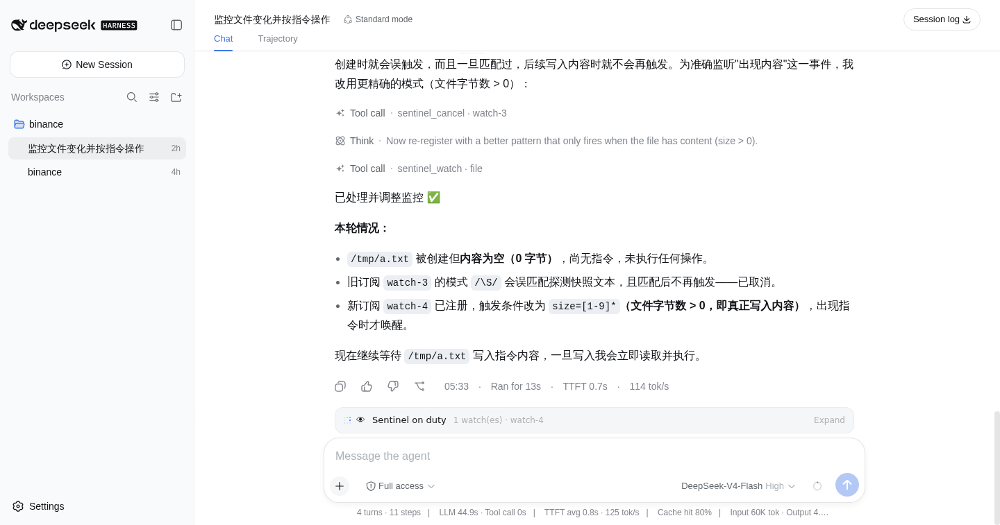
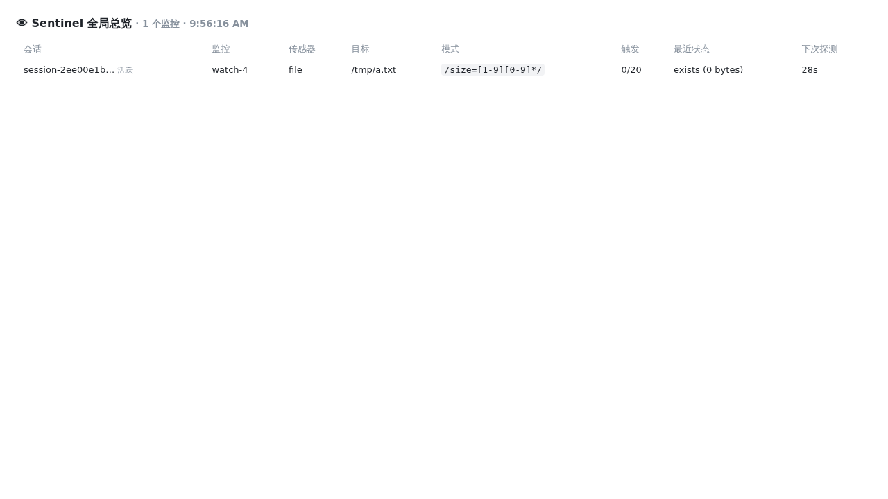
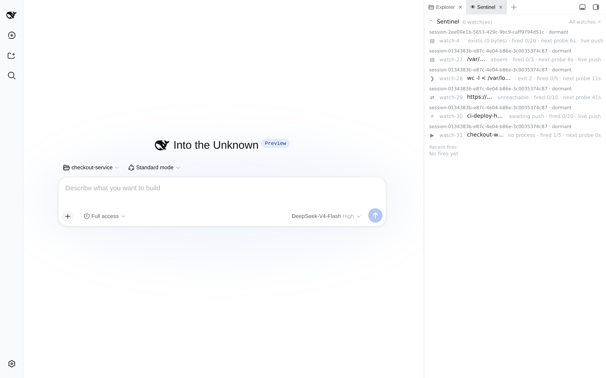

# dsh-sentinel

[English](README.md) | 中文

条件驱动的唤醒，给 [DeepSeek Harness](https://github.com/deepseek-ai/deepseek-harness) 用：agent 注册一条 watch 就可以去睡觉——甚至直接关掉会话——条件成立时由 sentinel 把它叫醒。每一次订阅、每一次触发都是用户可见的会话事件，浏览器 dock 上随时能看到谁在值守。



## 工作原理

Node 侧持有一个与 server 同生命周期的运行时：把插件自己的 sidecar 日志（`$DSH_HOME/sentinel.jsonl`）折叠成活跃订阅，按共享的 5 秒心跳逐个探测传感器，命中后走官方 followup 通道投递唤醒——必要时先复活休眠会话的 agent。所以订阅能扛住进程重启；server 停机期间变真的条件，会在下一次探测时补触发。

值守是常驻进程的事：探测和触发投递只在有一个长期运行的 dsh 进程（通常是 `dsh web`）时进行。一次性 headless 运行也能加载插件、创建/列出/取消 watch，但进程退出后没人探测——等下一个常驻进程起来，这些 watch 自动恢复值守。

每个 `$DSH_HOME` 只有一个值守 owner：租约文件 `sentinel.lease` 让第一个进程拥有探测和投递权；同一 home 上的第二个 dsh 进程保持被动（工具可用，写入照常落到共享 sidecar），owner 死后一个租约 TTL 内接管。owner 每个心跳重读 sidecar，被动实例上创建的 watch 会被自动收编。投递语义是 at-least-once：崩溃前已记录但没送出的触发，重启后从 `delivered` 水位线重新入队。

浏览器侧是 composer 上方的 dock 卡片（`conversation.input.dock` 族），列出本会话的活跃 watch——传感器、目标、实时探测状态、触发预算、下次探测倒计时——展开还有最近的触发历史。它轮询只读的 state 路由；会话没有 watch 时不渲染任何东西。

两个界面暴露 server 全局的 watch 集合。**侧边栏全局面板列表**里多出一个哨兵条目（`sidebar.panellist`，id `sentinel`），点击即在中栏（`main` 同名 key）打开 watch 表——只要有活跃 watch，图标上就带一个状态点。dashboard 是跨所有会话的全量 watch 表：会话（active/dormant）、传感器、目标、pattern、触发预算、最近探测状态、下次探测。



## 传感器

| kind | 引擎 | 触发条件 |
| --- | --- | --- |
| `file` | 路径快照 + inotify 推送 | 快照变化（亚秒级）；fs 事件加速 |
| `command` | 只读 shell 单行输出，按间隔探测 | 输出/退出码变化 |
| `http` | 按间隔探测 URL | 状态/响应体变化 |
| `process` | `pgrep -f` 模式，按间隔探测 | 匹配集变化 |
| `port` | 对 `[host:]port` 做 TCP 连接，按间隔探测 | 可达性变化（open/closed/timeout） |
| `webhook` | 纯推送 | 对返回的 hook URL 发任何 POST |

带 `pattern` 时，探测类传感器在该正则的"不匹配→匹配"边沿触发，webhook 只接受匹配的载荷；不带时，探测类传感器对基线之后的任何变化触发。

## 配置

所有部署相关的旋钮都在插件的 config schema 里（括号内为默认值），在 profile 的 `cordis.patch.yml` 里对 bundle 行覆盖：

```yaml
- id: dsh-sentinel
  name: dsh-sentinel
  config:
    heartbeatMs: 5000            # 探测轮间隔
    probeConcurrency: 8          # 每轮并发探测数
    maxSubscriptionsPerSession: 16
    maxPendingWakeups: 8         # 每会话排队唤醒上限，超出丢最旧的
    defaultIntervalSeconds: 30   # watch 未指定间隔时的默认值（5–86400）
    defaultCooldownSeconds: 60
    dutyLeaseTtlMs: 30000        # owner 死后被动实例的接管窗口
    notifyWebhookUrl: ''         # 可选：每次触发以 JSON POST 到这里
```

非法值会让插件加载时以 schema 错误失败，而不是运行时乱来。

`notifyWebhookUrl` 把每次触发以 JSON POST（`{plugin, event, sessionId, id, kind, target, note, fireNumber, maxFires, summary, after}`）送出 harness——指向飞书/企微/Slack 机器人或任意接收端都行。这条投递是 at-most-once：POST 失败只在日志里 warn，绝不阻塞 harness 内的唤醒。

## 工具

- `sentinel_watch` — 注册 watch：`kind`、`target`、可选 `pattern`、`interval`（1–3600 秒，默认 30）、`note`（随每次唤醒原样送达）、`maxFires`（默认 1：一次性）、`cooldown`（默认 60 秒）、可选 `ttl`。
- `sentinel_list` — 列出活跃 watch 及其实时探测状态。
- `sentinel_cancel` — 按 id 取消一条 watch。

## 路由

- `GET /plugins/dsh-sentinel/state?sessionId=…` — dock 和侧边栏面板用的只读状态（省略 `sessionId` 返回所有会话）。
- `GET /plugins/dsh-sentinel/dashboard` — server 全局 watch 表。
- `POST /plugins/dsh-sentinel/hook?id=watch-N&s=<sessionId>` — webhook 入口；把一条 `curl` 塞进 CI 任务、git hook 或另一台机器的脚本，就能叫醒 agent。watch id 按会话隔离，`s` 限定符保证两个会话的 `watch-1` hook 不打架（工具直接发完整 URL）。不带 `s` 的 URL 仍可用，解析到第一条匹配的 webhook watch。
- `POST /plugins/dsh-sentinel/cancel?sessionId=…&id=watch-N` — 手动取消。dashboard 表和每个 UI 行都带 ✕，任何 watch 都能手动停掉——包括会话和 agent 早就不在了的孤儿 watch；host 没有 session-deleted 事件，所以这是最后的兜底开关。
- 四条路由都带浏览器信任围栏：浏览器标记的跨站请求（恶意页面可以往 localhost form-POST）和 DNS rebinding 尝试（Host/Origin 指向 DNS 主机名）一律 403。`curl`、CI 任务这类无头客户端不受影响。state 路由还返回每个会话的 `duty`（租约心跳年龄）和 `droppedWakeups`（被 `maxPendingWakeups` 上限丢掉的排队唤醒）。

首次探测语义：不带 pattern 的 watch 把第一次观测吸收为基线（不触发）；带 pattern 的 watch 如果目标已经匹配，第一次探测就触发——条件本来就成立。

## 兼容性

在以下宿主版本上实测通过（插件加载、duty 租约持有、web 路由应答均正常）：

- `0.2.0-rc.2` —— 2026-09-30，运行时和客户端构建依赖对齐到此版本，并重新生成 npm、pnpm 锁文件。休眠会话唤醒时从会话投影恢复原 preset，并完整传递默认模型选择，包括思考强度。值守租约固定在运行时创建时的目录；清理等待启动和探测轮次结束后再释放租约。
- `0.1.7-rc.2` —— 2026-09-29，对线上 profile 的副本做整轮净装升级彩排：0.1.7 删除了共享的兜底 `plugin` 消息来源 kind（改为每个生产者声明自己的），因此唤醒携带 `{ kind: 'sentinel' }`——在会话流里落位同为 `context`，两条版本线上都渲染为 "Sentinel"。harness 依赖范围也重新钉到 0.1.7 线：严格 semver 下 `>=0.1.5-rc.2 <0.2.0` **不包含** `0.1.7-rc.2`（预发布规则），若不改，0.1.7 宿主会把本插件的 harness import 解析到 0.1.5 的副本——正是 0.1.5 对齐时消除掉的那类漂移。实测：`pnpm typecheck` 与全部 63 个测试通过，插件激活并持有 duty 租约，web 路由应答正常，下发的客户端 bundle 含 `sidebar.panellist`（boot 图 65 条）
- `0.1.5-rc.2` —— 2026-09-15，对齐 0.1.5 后的正式 web 部署实测：插件整条运行时 import 闭包都解析到部署线（harness 依赖改为显式 dependencies，profile 里更旧的 hoisted 副本再也遮不住它们），客户端半侧去掉 shim 后按真实 0.1.5 类型构建，`pnpm typecheck` 与全部 63 个测试通过，线上文件 watch 在改动后 1s 内经 inotify 触发，唤醒作为 plugin 来源的会话消息投递进会话；重启后部署下发的是新的客户端半侧（bundle rev 变更、含 `sidebar.panellist`、boot 图 54 条）
- `0.1.5-alpha.2` —— 2026-09-09，临时 web profile 实测：Node 插件加载、duty 租约、state/dashboard 路由和浏览器插件 bundle 均正常，浏览器控制台无报错；`conversation.input.dock` 仍是有效的会话级 list slot，插件 sidecar 不受 Session V3 迁移影响
- `0.1.1-rc.2` —— 2026-08-26，源码构建冒烟：git 装入 web profile，duty 租约持有，state 与 dashboard 路由应答正常
- `0.1.0-rc.8` —— 2026-08-20，scratch profile 冒烟
- `0.1.0-rc.7` —— 2026-08-20，正式 web 部署

这里的兼容指 cordis loader 条目、`ctx.agents` 跟进通道、所声明的 slot 座位和 web 路由持续可用；若某版本破坏了其中任一环节，请提 issue。插件的 harness 依赖（`@deepseek-ai/dsh-tools`、`@deepseek-ai/dsh-llm`、`@deepseek-ai/dsh-scope`）是钉在已验证版本线上的显式 dependencies，插件因此自带对齐副本，而不是继承 profile 里 hoisted store 恰好留下的版本；`@deepseek-ai/cordis` 仍是 peer，因为服务身份必须来自正在运行的宿主。

## 安装


走官方 bundle 通道一行装完：

```sh
dsh plugin --profile web add dsh-sentinel
```

或者直接从 git 装（构建产物直接提交在仓库里，git 源安装不需要跑构建）：

```sh
dsh plugin --profile web add "github:fuhefei/dsh-sentinel#v0.11.0"
```

或者手动加 node 半边：在你现有 base 上叠一层 patch-list 配置：

```yaml
# cordis.patch.yml
- insert:
    - id: dsh-sentinel
      name: dsh-sentinel
```

浏览器半边在同一个包里（`./client`），由 Web UI 的插件加载器注入。

### 侧边栏界面（0.1.5 及以后）

dock、侧边栏条目和 dashboard 在原版 host 上都能用：条目注册进官方 `sidebar.panellist` 座位，面板注册进布局的 `main` slot，无需给宿主打任何补丁。

在 0.1.2 及更早版本里，全局视图改而长在每条被监视会话行下方，需要官方树从未声明过的会话行扩展洞；该路径已退役，`patches/session-row-holes.patch` 只为那些旧树保留。0.1.5 起旧洞已不存在，面向它的插件必须改用上面的面板座位。

### better-sidebar 集成（可选）

同一 profile 里装有 [dsh-better-sidebar](https://github.com/omdsh-dev/DSH-better-sidebar) 时，sentinel 通过它公开的 `ctx.betterSidebar.registerTab` 扩展面，把全局 watch 表注册成一个侧边栏 tab（`dsh-sentinel:watches`，在 **+** 菜单里）：server 上每条 watch 的实时探测状态、触发预算和最近触发历史，由一个共享轮询器供数。无需配置；没装 better-sidebar 时注册静默跳过，dock / 面板 / dashboard 照常工作。



### 组合使用

和 [dsh-notification](https://github.com/omdsh-dev/dsh-notification) 一起装，整个唤醒回路就能到达桌面：sentinel 叫醒 agent，agent 干完这一轮，回合结束触发桌面通知——零集成代码，两个插件自己组合出来。

## 开发

```sh
npm install
npm run build     # tsc -b + tsdown (lib/index.js, lib/client.js)
npm test          # vitest: domain fold/normalize、传感器、dashboard 转义、e2e 唤醒流程
```

## 许可证

BSD-3-Clause，见 [LICENSE](LICENSE)。
